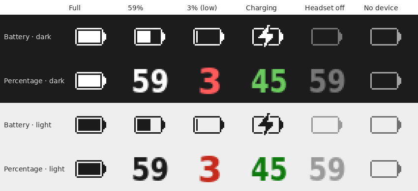
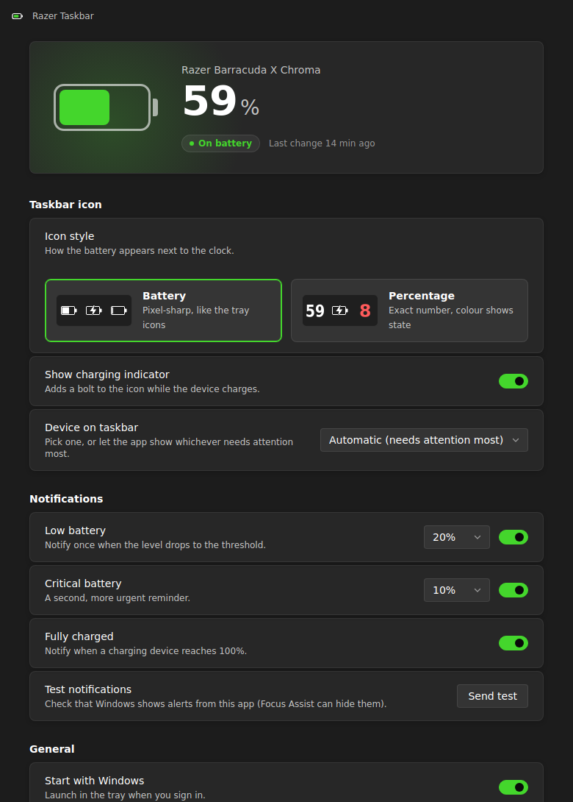
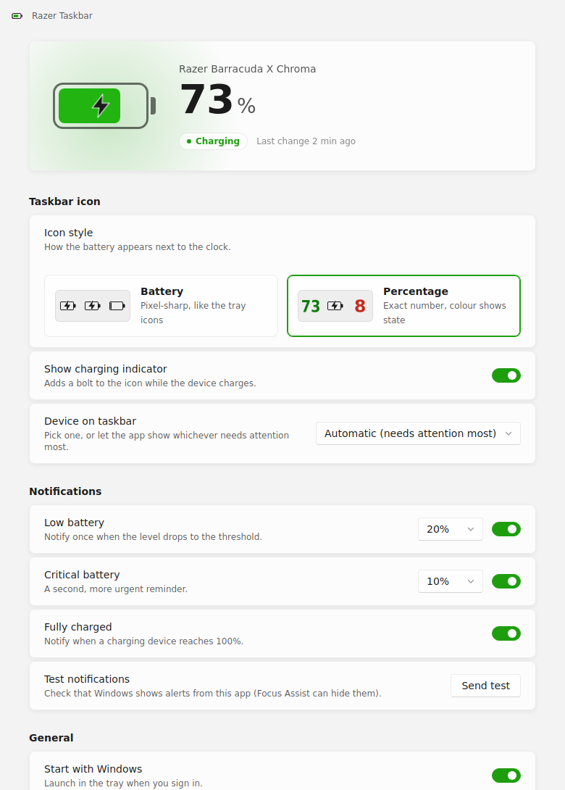

# razer-taskbar

A Windows tray icon that shows the battery level of wireless Razer devices (headsets, mice, keyboards)
next to the clock, the way Windows shows a laptop battery. It reads battery information from the logs that
Razer Synapse already writes, so it needs no drivers or USB access and works with any device Synapse supports.



## Features

- **Two icon styles:** a pixel-sharp battery drawn in the same style as the Windows tray icons, or the exact
  percentage as a number. Icons are drawn for every display scaling from 100% to 300% and follow the
  taskbar's light or dark mode.
- **Clear states:** charging (bolt, or a green number), low battery (red number), headset switched off
  (faded), and no device.
- **Notifications** for low battery, critical battery and fully charged. Thresholds are configurable and each
  alert fires once per crossing, not on every check.
- **Tooltip** with the device name, its state and when Synapse last reported a change.
- **Settings window** in the Windows 11 style (Mica, light/dark) with a Razer green accent and a live battery card.
- Left-click the tray icon to open settings. Launching the app a second time focuses the running copy.

| Dark | Light |
|:-:|:-:|
|  |  |

## Requirements

- Windows 10 or 11
- Razer Synapse 4 (or Synapse 3) running in the background
- For building from source: Node.js 22 LTS or newer

## Install

Download or build the setup file (see below) and run it. The icon appears in the tray; open **Settings** to
choose the icon style and turn on **Start with Windows**. If the icon is hidden behind the **^** arrow, drag it
onto the taskbar.

## Build from source

```powershell
npm install
npm start          # run in development mode
npm run make       # build the installer
```

The installer is written to `out\make\squirrel.windows\x64\razer-taskbar-<version> Setup.exe`, and a portable
zip to `out\make\zip\win32\x64\`.

Other scripts:

| Command | What it does |
|---|---|
| `npm test` | Unit tests (log parser, watcher, notifications, `.ico` writer, settings) |
| `npm run typecheck` | TypeScript type check |
| `npm run lint` | ESLint |
| `npm run check` | All three of the above |

Notifications only appear in the installed app, not with `npm start`: Windows only delivers them to apps with a
Start menu shortcut, which the installer creates.

## Supported hardware

Any wireless Razer device that Synapse 3 or 4 shows a battery level for. Tested with:

- Razer Barracuda X Chroma (HyperSpeed dongle), Synapse 4
- Razer BlackShark V2 Pro (2023)

## How it works

Synapse 4 writes a `connectingDeviceData` line to
`%LOCALAPPDATA%\Razer\RazerAppEngine\User Data\Logs\systray_systrayv2*.log` whenever a device connects or its
state changes. The app follows the newest of these files, reads only the new lines, and turns them into the tray
icon, tooltip and notifications. For Synapse 3 it reads `%LOCALAPPDATA%\Razer\Synapse3\Log\Razer Synapse 3.log`.

- [docs/synapse-logs.md](docs/synapse-logs.md): what Synapse logs, the power states, and its quirks.
- [docs/architecture.md](docs/architecture.md): how the code is organised and how data flows.

**Known limitation:** the app can only show what Synapse writes. While charging, the headset reports every 1%
step. On battery, Synapse may not log a new level for a long time, so the number can lag behind until Synapse
queries the device again (for example when its window is opened).

## Troubleshooting

| Problem | Fix |
|---|---|
| `npm.ps1 cannot be loaded because running scripts is disabled` | Run `Set-ExecutionPolicy -Scope CurrentUser RemoteSigned` once, or use `npm.cmd` instead of `npm`. |
| `Electron failed to install correctly` | Run `node node_modules/electron/install.js`. If it exits without downloading anything, use Node 22 LTS, or download `electron-v<version>-win32-x64.zip` from the Electron releases page, extract it to `node_modules\electron\dist` and create `node_modules\electron\path.txt` containing `electron.exe`. |
| `EPERM: operation not permitted` during `npm install` | The project is in a synced folder (OneDrive) or another program has it open. Move it to a local folder such as `C:\dev` and install again. |
| Icon shows "no device" | Check that Synapse is running and shows the device. **Settings → Synapse logs** opens the log folder. |
| Number looks out of date | See the known limitation above. Opening Synapse makes it query the device. |
| No notifications | Use the installed app, not `npm start`, and check Focus Assist / Do Not Disturb. **Settings → Send test** checks delivery. |

## Project layout

```
assets/                 App icon (installer, exe, window, notifications)
docs/                   Documentation and screenshots
src/
  main/                 Electron main process
    index.ts            App start-up, settings window, IPC
    tray_manager.ts     Tray icon, tooltip, context menu
    icon_renderer.ts    Draws tray icons (pixel-exact) in a hidden window
    ico.ts              Writes multi-size .ico files for the Windows tray
    notifier.ts         Low / critical / fully-charged notifications
    settings_manager.ts Settings file, validation, change events
    taskbar_theme.ts    Detects the taskbar's light/dark mode
    watcher/            Synapse log watchers and parser
  renderer/             Settings window (HTML, CSS, TS)
  shared/types.ts       Types shared by main, preload and renderer
  preload.ts            Safe bridge between the settings window and main
test/                   Unit tests (node:test) with synthetic log lines
```

## Credits

- Original project by [sanraith](https://github.com/sanraith/razer-taskbar) (MIT).
- Inspired by [Tekk-Know/RazerBatteryTaskbar](https://github.com/Tekk-Know/RazerBatteryTaskbar).

## License

MIT, see [LICENSE](LICENSE).
