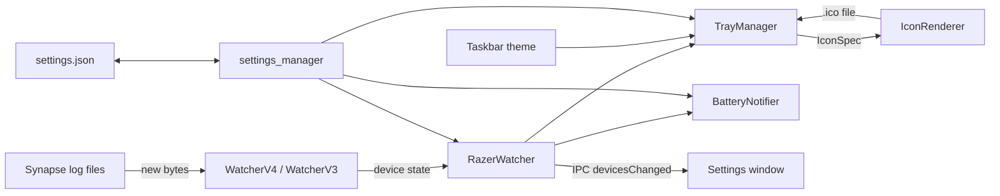

# Architecture

razer-taskbar is an Electron app with no visible main window. It lives in the tray, and a settings window
opens on demand.

## Processes

| Part | Where | Role |
|---|---|---|
| Main process | `src/main/` | Watches logs, owns device state, tray, notifications, settings |
| Preload | `src/preload.ts` | Exposes a small typed API (`window.trayApp`) to the settings window |
| Settings window | `src/renderer/` | Sandboxed page. Talks to main only through the preload API |
| Icon renderer | hidden `BrowserWindow` in `icon_renderer.ts` | Draws icons on a `<canvas>` |

## Device state

`RazerWatcher` owns a `Map<handle, RazerDevice>` (see `src/shared/types.ts`) and starts the right watcher:

- **WatcherV4** (Synapse 4) finds the newest `systray_systrayv2*.log`, reads it once, and if there is no battery
  line yet reads back through older rotated files. After that it polls the file size with `fs.watchFile` and reads
  only the appended bytes. `LineAccumulator` keeps incomplete lines, including split UTF-8 characters, until the
  rest arrives. Parsing is in `synapse4_parser.ts`, which has no Electron imports so it can be unit tested.
- **WatcherV3** (Synapse 3) reads the whole log on change, throttled.
- `RazerWatcher` also watches the log folder and restarts the watcher when Synapse rotates to a new file.

Watchers replace map entries rather than mutating them, then call `notify()` once per batch of events.

## Tray icon

`TrayManager.update()` picks the device to show (the one chosen in settings, otherwise the connected device
that needs attention most), builds an `IconSpec`, and asks `IconRenderer` for an image.

`IconRenderer` runs a self-contained drawing function (`drawIcons`) in a hidden, sandboxed window:

- The battery style is drawn with whole-pixel `fillRect` calls, with no anti-aliasing: 1 px strokes up to 150%
  scaling and 2 px from 175%, to match the shell's own tray icons. The charging bolt is rasterised with a
  threshold and cut out of the battery by 1 px.
- The percentage style draws the number in Segoe UI Variable, sized to about 75% of the icon height. It can be
  condensed by up to 15% so two digits stay tall at 16 px. At 100% it shows the full battery.

**Windows DPI detail:** Electron converts a `NativeImage` to the tray `HICON` using only its 1x bitmap, so at
125% or 150% scaling Windows would stretch the 16 px image and blur it. On Windows, `IconRenderer` therefore
writes a multi-size `.ico` file (16–48 px, see `ico.ts`) to `%APPDATA%\razer-taskbar\tray-icons\`, and the tray
loads it by path. Windows then picks the exact size for the current scaling. The cache folder is cleared at
start-up.

`taskbar_theme.ts` reads `SystemUsesLightTheme` from the registry (the taskbar's own light/dark setting, separate
from the app theme) so icons are white on a dark taskbar and black on a light one.

## Notifications

`BatteryNotifier.evaluate()` is pure decision logic per device:

- **Low** and **critical** fire once when the level drops to their threshold. They re-arm after charging, or
  once the level climbs 5 points above the threshold.
- **Fully charged** fires once when a charging device reaches 100%, and re-arms when it stops charging.
- Nothing fires while a device is off or disconnected.

On Windows, notifications need the AppUserModelID that the Squirrel installer's Start menu shortcut uses
(`com.squirrel.razer_taskbar.razer-taskbar`), so they only appear in the installed app.

## Settings

`settings_manager.ts` stores `settings.json` in the Electron `userData` folder. On load it merges the file with
the defaults, so settings added in newer versions don't reset the user's existing choices. It drops unknown
keys and wrong types and clamps numbers. Each changed key emits a typed event that the tray, watcher and
notifier subscribe to.

## Tests

`npm test` runs the `node:test` suites in `test/` through ts-node. `test/helpers/electron_stub.ts` replaces the
`electron` module so main-process code can be imported under plain Node. The watcher test writes synthetic log
files to a temporary folder and checks rotation fallback, partial writes, unknown levels, serial-less
reconnects and disconnects.
